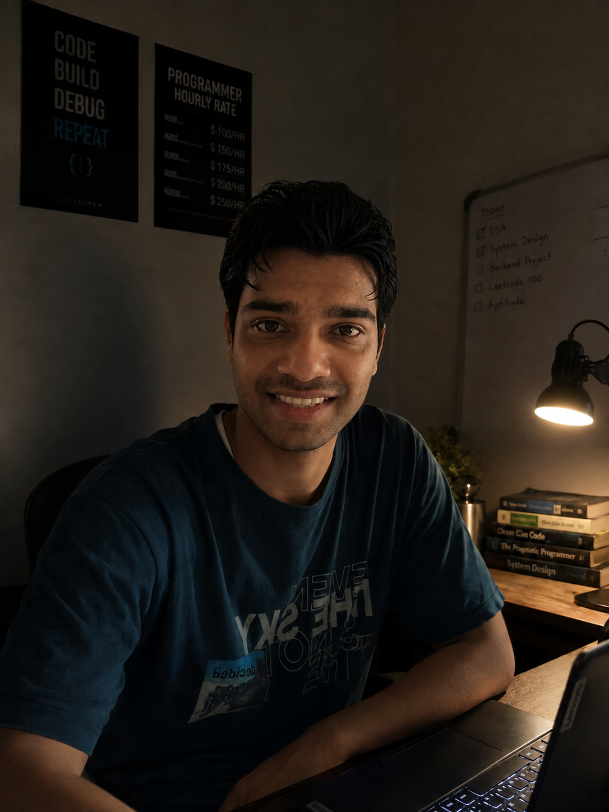

# 🌐 Varad Gaikwad — Portfolio

My personal developer portfolio built with Next.js, React, TypeScript and Tailwind CSS.

## 🚀 Live Website

👉 https://portfolio-nu-nine-8m9g1qkl9i.vercel.app/

## 🛠️ Tech Stack

- Next.js
- React
- TypeScript
- Tailwind CSS
- JavaScript

## ✨ Features

- Responsive portfolio design
- Animated hero section
- About Me section
- Projects showcase
- Skills section
- Resume section
- Contact section
- Smooth navigation
- Modern dark UI

## 📂 Featured Projects

### Mini LeetCode
Coding practice platform with authentication and problem solving.

### ATM System
Java and MySQL based banking application using JDBC.

### Women Safety System
Python and Machine Learning based system for intelligent detection.

## 📸 Preview

## 👨‍💻 Author

**Varad Gaikwad**

Java Backend Developer | Full Stack Developer | AI Enthusiast
